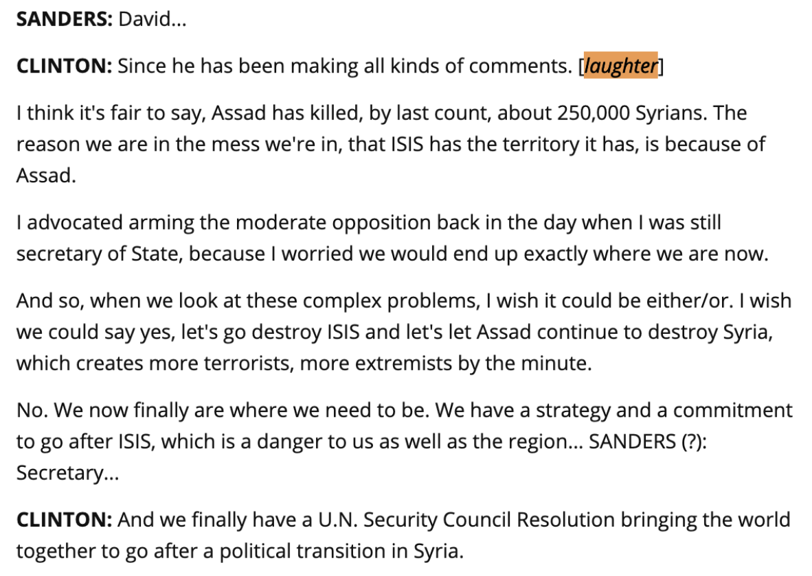
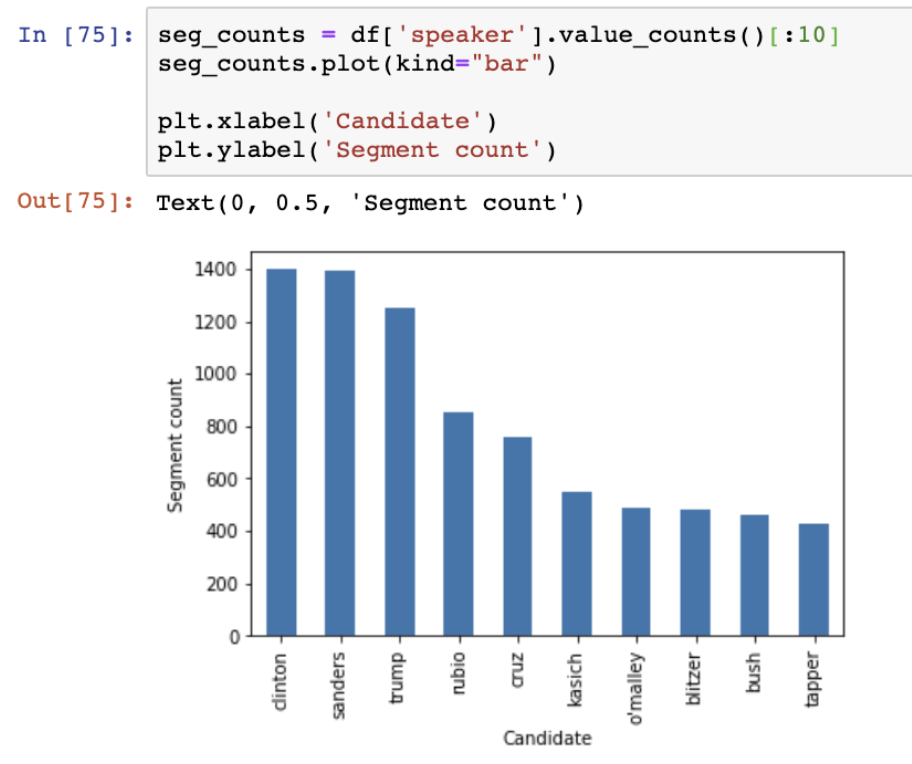
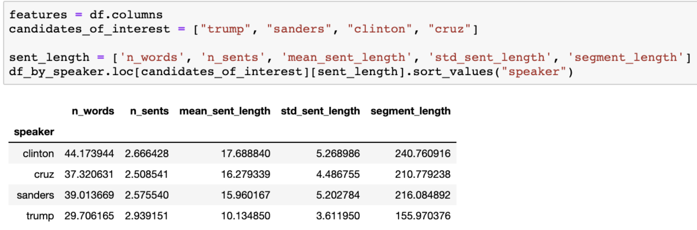
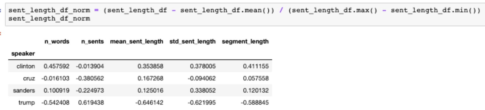
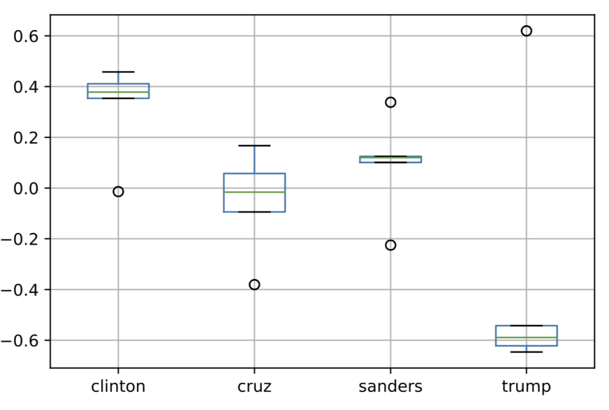
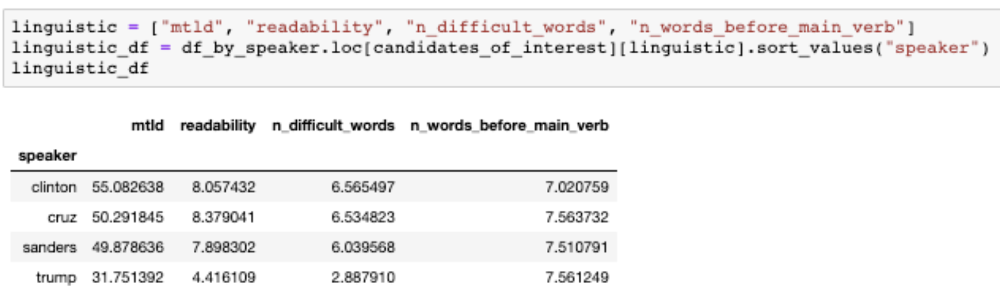
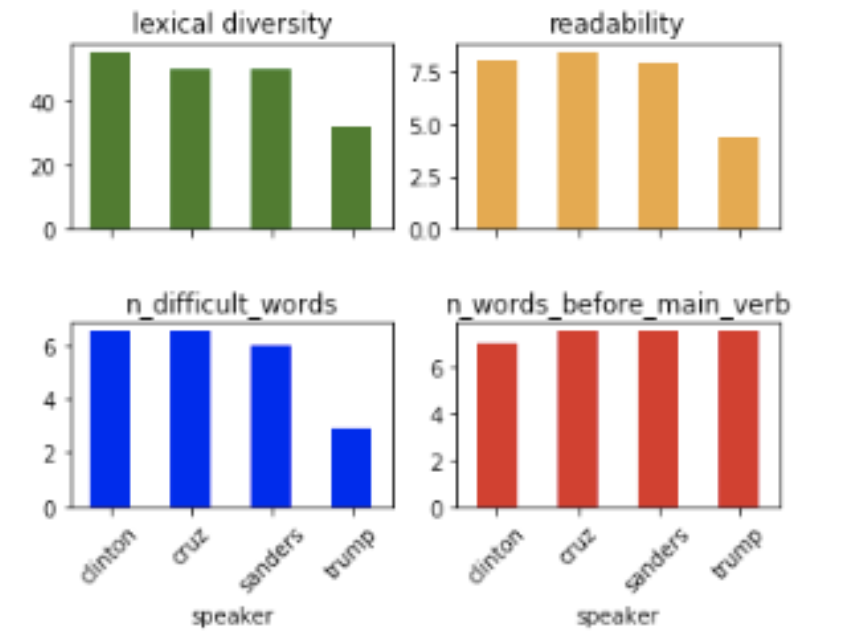
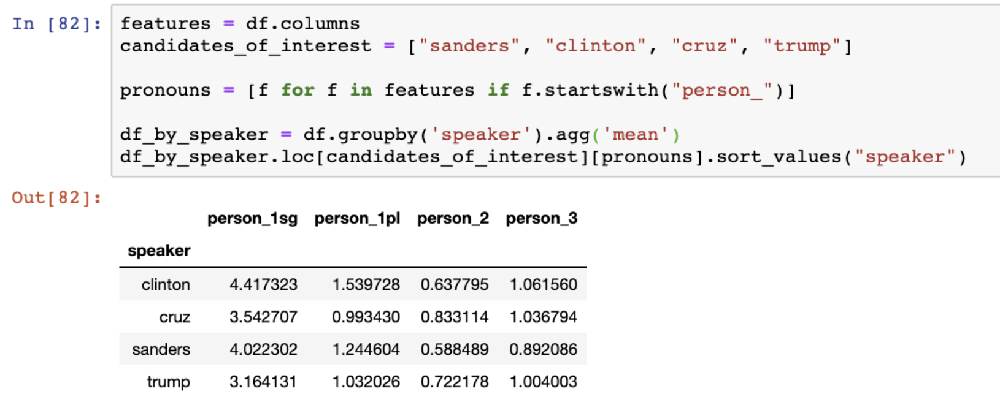
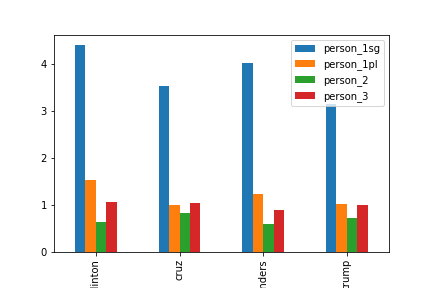

# 🇺🇸 Primary debates 2015-2016 

## Installation

```
python setup.py develop
pip install -r requirements.txt
```

## Motivation 

* The election’s approaching!
* Compare candidate speeches in the primary debates of 2015-2016
* See how much of an outlier Trump was
* A future application: predict the nominees for 2020

## Data source & preprocessing

20 Democratic and Republican debate transcripts from UC Santa Barbara [The
American Presidency Project](https://www.presidency.ucsb.edu/documents/presidential-documents-archive-guidebook/presidential-candidates-debates-1960-2016).

A transcript excerpt: 



### Preprocessing steps
1. Remove transcriptions of non-verbal utterances like `[laughter]`.
2. Speech segmentation: tag each paragraph (separated by a newline) with a candidate name.
3. Remove rows where `segment` was `NaN`. 

Each data point is a candidate name-segment pair, where the candidate name is the label:

```
# one data point 
CLINTON: Since he has been making all kinds of comments.

# another data point
CLINTON: I think it's fair to say, Assad has killed, by last count, about 250,000 Syrians. The reason we are in the mess we're in, that ISIS has the territory it has, is because of Assad.
```

## Feature selection 

Features used:

1. Sentence length stats 
2. Lexical density
4. Readability
5. Pronoun counts by person/number (1st person, 2nd person, 3rd person) 
6. Syntactic complexity (as measured by # of words before main verb) 

##### Sentence length 

* `mean_sent_length`
* `std_sent_length`
* `segment_length` (# of characters)

##### Lexical density
MTLD, or Measure of textual lexical diversity (McCarthy 2005, McCarthy and
Jarvis 2010), was used to compute the lexical density of segments.
[Lexical Richness](https://pypi.org/project/lexicalrichness/) contains various
methods to compute lexical richness measures.


##### Difficult words count and readability
[textstat](https://pypi.org/project/textstat/) was to calculate statistics from
text to determine readability and difficult words count. Readability approximates
the grade level one needs to be to comprehend the text.

##### Pronoun counts
* `person_1sg`: count of occurrences of "I", "my", "mine", "myself"
* `person_1pl` count of occurrences of  "we", "our", "ours", "ourselves"
* `person_2`: count of occurrences of  "you", "your", "yours", "yourself", "yourselves"
* `person_3`: count of occurrences of  "he", "she", "they", "her", "his", "their", "him",
"her", "them", "hers", "theirs", "himself", "herself", "themselves"  

##### Syntactic complexity 

Number of words before the main verb was used as a measure of syntactic
complexity. The higher this number, the more complex the segment. It may signal
the presence of a subordinate clause and/or a richly modified or coordinated
subject phrase.

### Usage example
For feature implementation, instantiate an object of type `Featurizer`, found
in `src/presidential/features.py`.

```python
from presidential.features import Featurizer

f = Featurizer()

text = "And we also need to make sure Trump's messages don't fall on receptive ears. Trump is becoming ISIS's best recruiter. They are going to people showing videos of Donald Trump insulting Islam and Muslims in order to recruit more radical jihadists."

f.get_n_opponent_mentions(text)  # 3

```

## Analysis

#### Who spoke the most? 

Clinton, Sanders, Trump, Rubio, and Cruz, in that order, spent the most time
talking in terms of total segment count (total number of paragraphs in the transcripts).



There are other ways of representing length of speech though.



After normalization:





Trump spoke significantly less than the other top candidates.

#### Lexical and syntactic features





#### Pronoun counts






## Next steps

* IDF-weighted vector embeddings as a set of features to train a classification model 
* Compute cosine similarity between the last year's candidates and this year's
